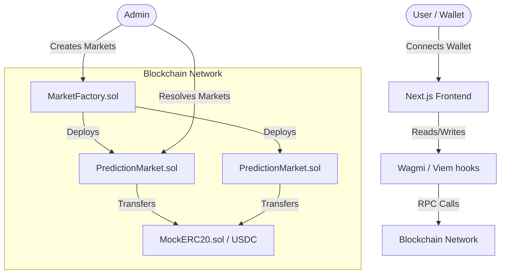

# NaijaMarket - Technical Documentation

This document provides an overview of the current technical state of the NaijaMarket prediction platform, including the technology stack, project architecture, setup instructions, and the features implemented so far, alongside a detailed roadmap for future improvements.

## 1. Overview & Technology Stack

NaijaMarket is a decentralized prediction market tailored for the Nigerian user base. It features a parimutuel betting system, where users can bet on binary (Yes/No) outcomes using an ERC20 token as collateral.

### Frontend
- **Framework**: [Next.js](https://nextjs.org/) 14 (App Router)
- **UI Library**: [React](https://react.dev/) 18
- **Styling**: [Tailwind CSS](https://tailwindcss.com/) with `clsx` and `tailwind-merge`
- **Animations**: [Framer Motion](https://www.framer.com/motion/)
- **Charts**: [Recharts](https://recharts.org/)
- **Icons**: [Lucide React](https://lucide.dev/)

### Web3 Integration
- **Wallet Connectivity**: [RainbowKit](https://www.rainbowkit.com/)
- **Ethereum React Hooks**: [Wagmi](https://wagmi.sh/)
- **Ethereum Interactions**: [Viem](https://viem.sh/)

### Smart Contracts
- **Language**: Solidity `^0.8.24`
- **Development Environment**: [Hardhat](https://hardhat.org/)
- **Libraries**: [OpenZeppelin Contracts](https://www.openzeppelin.com/contracts) (IERC20, SafeERC20, ReentrancyGuard)

---

## 2. Project Architecture & Directory Structure

The repository is structured as a monorepo containing both the frontend application and the backend smart contracts.

```text
polymarket-app/
├── contracts/               # Hardhat project for Smart Contracts
│   ├── contracts/           # Solidity source files
│   ├── scripts/             # Deployment scripts
│   └── test/                # Smart contract tests
└── src/                     # Next.js Frontend Application
    ├── app/                 # App Router pages and layouts
    └── components/          # Reusable React components
```

---

## 3. System Architecture



---

## 4. Smart Contracts Implementation

The core logic of the prediction market is implemented using robust, security-focused Solidity contracts.

### `MarketFactory.sol`
Acts as the central registry and deployer for all prediction markets.
- **Market Creation**: Allows the contract owner to deploy new `PredictionMarket` instances.
- **Fee Management**: Configures a global platform fee percentage (max 10%) and designates a fee recipient address.
- **Market Tracking**: Maintains an array of all deployed market addresses.

### `PredictionMarket.sol`
Represents an individual binary prediction market (Yes/No).
- **Parimutuel Betting System**: Users buy shares for `Yes` or `No` outcomes using a specified ERC20 collateral token. The odds and payouts are dynamically determined by the total liquidity in each pool.
- **Market States**: `Active`, `Resolved`, and `Cancelled`.
- **Resolution**: A designated `resolver` address is authorized to resolve the market with a final outcome once the `endTime` is reached.
- **Claiming Winnings**: Winning users can claim their payouts, which are calculated proportionally to their pool share. Platform fees are deducted automatically from the profits (principal is not taxed).
- **Security**: Utilizes OpenZeppelin's `ReentrancyGuard` for functions like `buyShares` and `claimWinnings` to prevent reentrancy attacks, and `SafeERC20` for secure token transfers.

### `MockERC20.sol`
A standard ERC20 token used for local testing and development to simulate stablecoin collateral.

---

## 5. Frontend Implementation

The frontend is built to be highly responsive, modern, and user-friendly, catering to both crypto-native and non-crypto-native users.

### Pages (`src/app/`)
- **`/` (Home)**: The main landing page, displaying trending markets and an overview of available categories.
- **`/admin`**: A secure, wallet-authenticated dashboard for the platform owner to create and manage markets (integrating with `MarketFactory`).
- **`/market/[id]`**: The detailed view for a specific market, showing the question, charts, and the trading terminal.
- **`/[category]`**: Dynamic routes for filtering markets by categories (e.g., Politics, Sports, Entertainment).

### Components (`src/components/`)
- **`ui/` (Layout & Shell)**: `Navbar.tsx`, `Sidebar.tsx`.
- **`market/` (Core Features)**: 
  - `MarketCard.tsx`: Summary card displaying market question, image, category, and odds.
  - `TradingTerminal.tsx`: Interface to input wager amounts, select Yes/No, and interact with contracts.
  - `MarketChart.tsx`: Dynamic line/area chart visualizing odds/volume over time.
  - `TrendingBanner.tsx`: Highlighted section for active markets.
  - `MarketGrid.tsx`: Responsive grid layout for `MarketCard`.

---

## 6. Setup Instructions

### Prerequisites
- Node.js `^20.0.0`
- npm or yarn or pnpm
- MetaMask or another web3 wallet

### Local Development
1. **Install dependencies:**
   ```bash
   npm install
   ```
2. **Start the local Hardhat node:**
   ```bash
   cd contracts
   npx hardhat node
   ```
3. **Deploy the contracts locally:**
   Keep the node running, open a new terminal, and run:
   ```bash
   cd contracts
   npx hardhat run scripts/deploy.ts --network localhost
   ```
   *(Update the deployed contract addresses in your frontend `.env.local` file).*
4. **Run the Next.js development server:**
   ```bash
   cd ..
   npm run dev
   ```
5. **Open** `http://localhost:3000` in your browser.

---

## 7. Areas of Improvement (Next Steps)

While the core infrastructure is established, the platform can be further optimized and expanded. Below are the key areas for improvement:

### 🚀 1. Frontend & Web3 Integration
- **Finalize Smart Contract Hooks**: Complete the integration between the `TradingTerminal` and the deployed smart contracts using `wagmi`. Specifically, read real-time data (`totalYesPool`, `totalNoPool`) and execute `buyShares` and `claimWinnings` transactions.
- **Optimistic UI Updates**: Implement optimistic UI rendering when a user executes a trade to improve the perceived performance of the app before the transaction is confirmed on-chain.
- **Transaction Feedback**: Add comprehensive toast notifications (e.g., using `sonner` or `react-hot-toast`) for transaction states: Pending, Success, and Error.

### 📊 2. Data Indexing & Backend
- **Implement a Graph Node**: Relying purely on RPC calls for historical data (e.g., charts, user portfolios) is inefficient. Implement a subgraph using **The Graph** to index market creation, trades, and resolution events.
- **Caching Layer**: Introduce a caching layer (e.g., Redis via a lightweight Next.js API route) for off-chain metadata (like market images and descriptions) to reduce load times.

### 🛡️ 3. Security & Smart Contracts
- **Oracle Integration for Resolution**: Currently, a designated `resolver` address resolves markets. Transition to a decentralized oracle system (like Chainlink or UMA) for trustless market resolution.
- **Audit Preparedness**: Increase smart contract test coverage to near 100% and prepare the codebase for a formal security audit.
- **Dynamic Fees**: Implement a dynamic fee structure based on trade volume or user tiers instead of a static global platform fee.

### 🎨 4. UI/UX Enhancements
- **Fiat On-Ramp**: Integrate a fiat-to-crypto on-ramp (like MoonPay or Transak) to lower the barrier to entry for users without existing crypto wallets.
- **Social Features**: Add features such as commenting on markets, user leaderboards, and sharing markets on social media to build community engagement.
- **Mobile Optimization**: Conduct extensive testing on mobile devices to ensure the trading terminal and charts are perfectly responsive and easy to use on smaller screens.

### 📈 5. Performance Optimization
- **Image Optimization**: Ensure all market images are routed through Next.js `next/image` for automatic compression and WebP conversion.
- **Bundle Size Reduction**: Analyze and reduce the Next.js bundle size, potentially by lazily loading the heavy charting libraries (`recharts`) only when the market details page is rendered.
